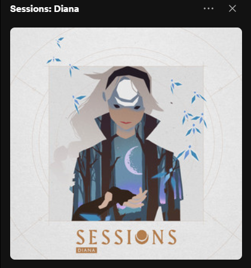
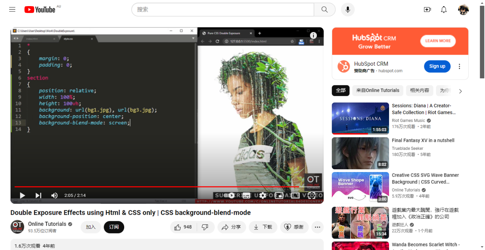

# yilu0190_9103_tut7
## Part 1: Imaging Technique Inspiration

    This is the cover of an album Sessions: Diana, which from Riot Music. I think the moonlight with the forest present in the body of Diana in this cover is very beautiful and make me feel calm. I hope that the technique of presenting beautiful natural environment in an object can be incorporated into my project. For Diana in this cover, it has multiple layers. It divided into 4 layers: first, the fore hairs, head, neck, and hand on the top layer. Then is the body. Then the scenery inside the body. The last layer is the hair.

## Part 2: Coding Technique Exploration
I think maybe I can use `mask()` and `blendMode()` in p5.js, or mix-blend-mod in CSS to achieve and contribute to my desired effect.
1. I can use the `mask()` to mask part of the scene image in a shape.

[Click here go to the p5.js reference](https://p5js.org/reference/#/p5.Image/mask)
2. And then use the `blendMode()` to mix those 2 image up, make them become more harmonious.

[Click here go to the p5.js reference](https://p5js.org/reference/#/p5/blendMode)
3. Or I can achieve all the effect with CSS.

[The video from Youtube](https://www.youtube.com/watch?v=0h58wIZ_-4Q)